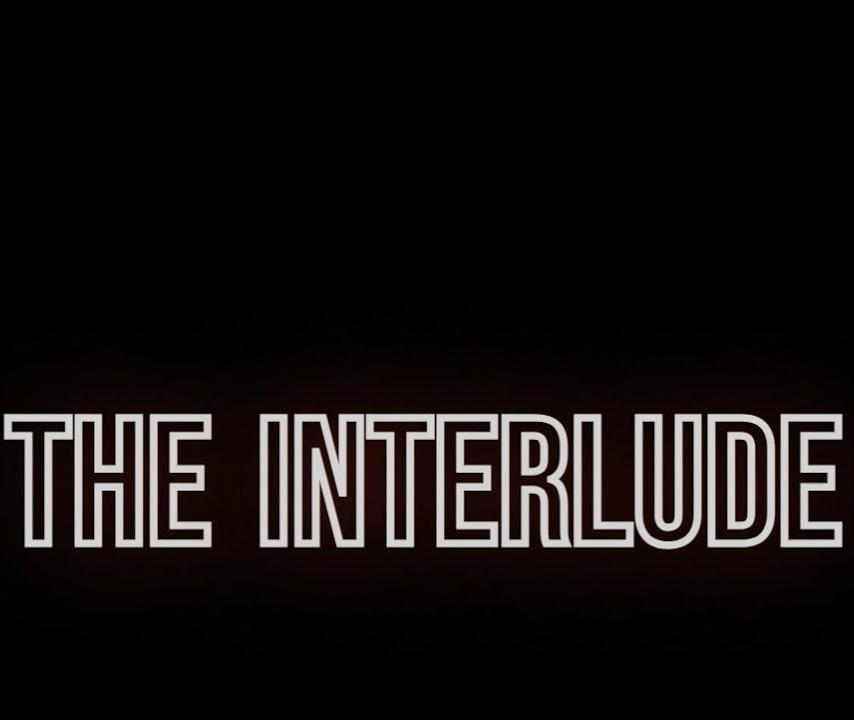

# <div align="center"> Hello there, I'm Karthik Veeranala</div>

<div align="center">
  <a href="https://karthikveeranala.github.io/karthikv/">
    
  </a>
  <p align="center">
    <a href="https://karthikveeranala.github.io/karthikv/">
      
    </a>
    <a href="https://karthikveeranala.github.io/karthikv/demo-reel/">
      
    </a>
    <a href="https://karthikveeranala.github.io/karthikv/arcade/">
      
    </a>
    <a href="https://github.com/KarthikVeeranala">
      
    </a>
    <a href="https://github.com/KarthikVeeranala">
      
    </a>
  </p>
</div>

### <div align="center">🎮 Game Developer & Game Designer | Unreal Engine 5.7 C++ & Combat Systems</div>

<br>

I am a **Game Developer and Game Designer** pursuing a **B.Tech in Computer Science and Engineering** at the Institute of Aeronautical Engineering (IARE), Hyderabad (2023–2027). My engineering philosophy centers on **ruthless execution under constraints**, deterministic combat feel, low-latency animation buffering, and real-time player experience.

Over the past three years, I have spearheaded teams in 24–48 hour competitive game hackathons—winning **1st Place Overall at CodeDay 2.0**, **2nd Place at HackRush**, and **Top 3 at MLH FrostHacks**—alongside earning a **Top 45 Indie Finalist** selection at the **India Game Developer Conference (IGDC 2024)** for *City of Aethel*.

During my gameplay engineering and combat design tenure at **Aicade**, I architected **14 playable 2D prototypes** testing combat feel, rigid-body ragdoll impulses, projectile parabolas, and boss encounter choreography.

Currently, as an **Unreal Engine Developer & Tools Programmer at Cyrus 365**, I architect project-agnostic UE 5.7 C++ test automation harnesses, isolated Win32 desktop sandboxing, and real-time GPU backbuffer streaming.

As **President of the Elysium Gaming Club** at IARE, I direct campus game development bootcamps, Unreal and Unity workshops, and collegiate esports tournaments for a community of **250+ active student developers**.

> 🏆 **1st Place Overall Winner** at CodeDay 2.0 with *The Interlude* (6-DOF Zero-G Space Dogfight in UE4).<br>
> 🥈 **2nd Place Overall Winner** at HackRush with *ByteOasis: Code to Escape* (Terminal Simulation & Environmental Puzzles).<br>
> 🥉 **Top 3 Overall Winner** at MLH FrostHacks with *Geek'O'Wars* (Third-Person Cyber Malware Survival).<br>
> 🎖️ **Top 45 Indie Finalist** at India Game Developer Conference (IGDC 2024) for *City of Aethel* (5-Hit Melee & i-Frame Dodge Rolls).<br>
> 🕹️ **President & Game Jam Director** at Elysium Gaming Club (Mentoring 250+ student game developers).

---

##  Player Profile // C++ Identity

```cpp
struct FKarthikVeeranala
{
    FString Role = TEXT("Game Developer & Game Designer");
    FString Education = TEXT("B.Tech CSE, IARE Hyderabad (2023–2027)");
    TArray<FString> CoreCompetencies = {
        TEXT("Unreal Engine 5 Core C++ Architecture"),
        TEXT("Real-Time Combat Feel & 180ms i-Frame Buffering"),
        TEXT("Isolated Win32 Subsystems & Slate/UMG Discovery"),
        TEXT("6-DOF Newtonian Zero-G Physics & Predictive Lead AI"),
        TEXT("Playable 2D Web Prototypes (Phaser 3 / WebGL / Matter.js)")
    };
    FString EngineeringPhilosophy = TEXT("Every mechanic hides a story. Every prototype is a question made playable.");
};
